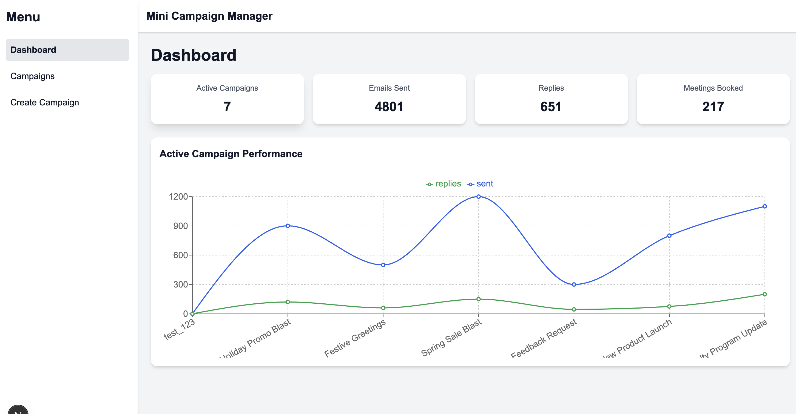
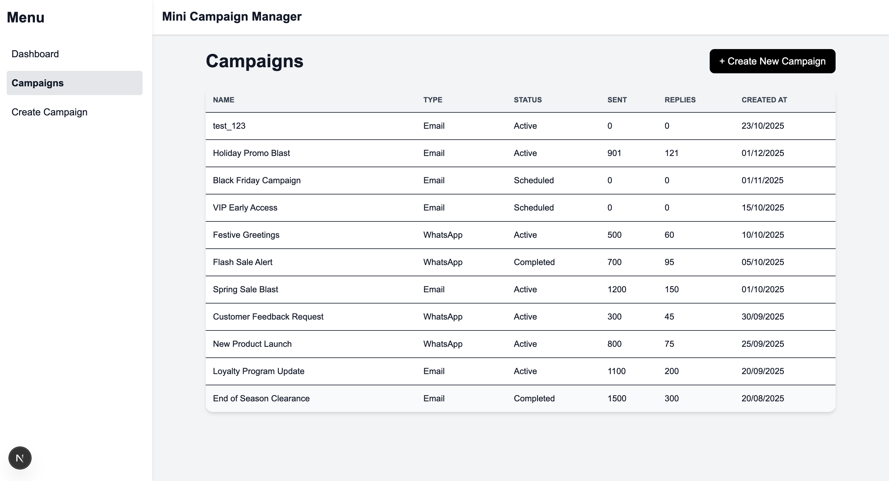
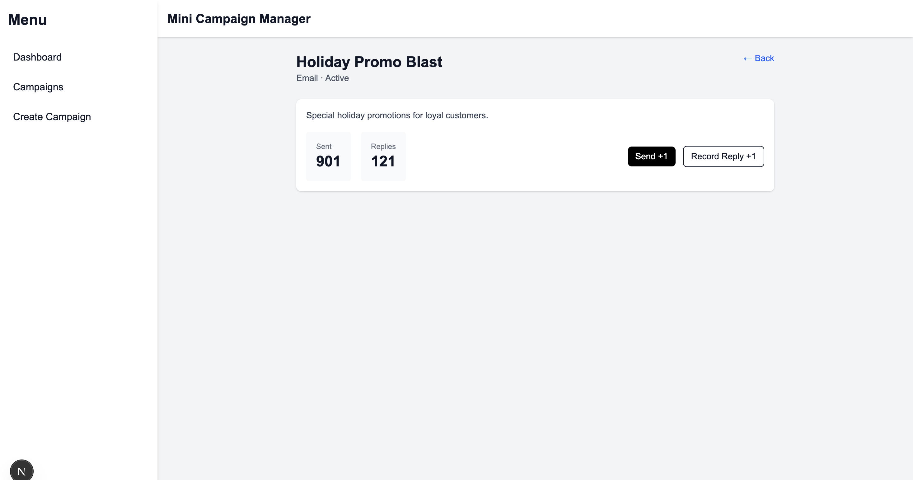
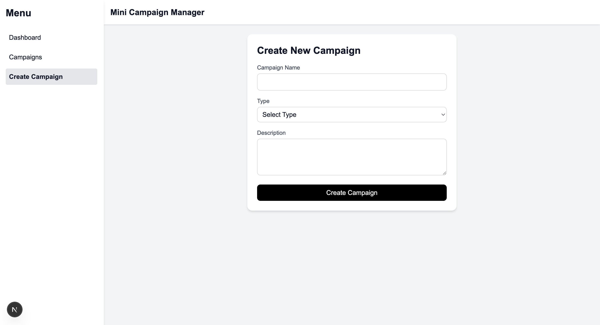

# Mini Campaign Manager

A **Mini Campaign Manager** is a responsive web application built with **Next.js (SSR), TypeScript, TailwindCSS, allowing users to manage campaigns efficiently. The app demonstrates a clean dashboard-style interface with campaign listing, creation, and tracking functionalities. Optional backend integration is implemented using **NestJS/Express.js**.

**Project URL: https://mini-campaign-manager-azure.vercel.app/**
---

## Table of Contents

- Features  
- Tech Stack
- Screenshots
- Getting Started
- Project Structure
- Frontend (SSR)
  
---

## Features

### Dashboard
- Summary cards: Active Campaigns, Emails Sent, Replies, Meetings Booked  
- Responsive chart using **Recharts**  
- Sidebar navigation: Dashboard, Campaigns, Create campaign  

### Campaign List
- Table view showing campaign details: Name, Status, Sent, Replies, Created At  
- "Create New Campaign" button opens a modal or navigates to campaign creation page  
- View campaign details and increment `Sent` and `Replies` count  

### Create Campaign
- Form fields: Campaign Name, Type (Email / WhatsApp), Description  
- Field validation using **React Hook Form + Zod**  
- Save campaign data to **localStorage** or backend API  
- Success toast/modal confirmation  

### Backend Integration (Optional)
- `GET /campaigns` → Returns static/dummy campaigns  
- `POST /campaigns` → Accepts new campaign data and stores it in memory/JSON file  
- `PATCH /campaigns/:id` → Updates `Sent` and `Replies` count for a specific campaign  
- Frontend communicates with API using **Axios** or **Fetch**

---

## Tech Stack

- Next.js (SSR)  
- TypeScript  
- TailwindCSS  
- React Hook Form + Zod  
- Recharts (Charts)  
- MongoDB

# How to Run

## 1. Clone the Repository
- git clone <your-repo-url>
- cd mini-campaign-manager

## 2. Install Dependencies
- npm install

## 3. Set Up Environment Variables
- Create a .env.local file in the root folder.
- Add your MongoDB connection string as MONGODB_URI

## 4. Run the Development Server
- npm run dev
- Open http://localhost:3000 in the browser.

---

## Screenshots

**Dashboard:**  
  

**Campaign List:**  
  

**Campaign details page:**  
 

**Create Campaign Form:**  
   